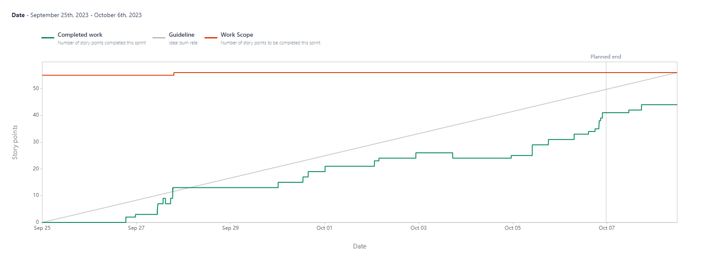
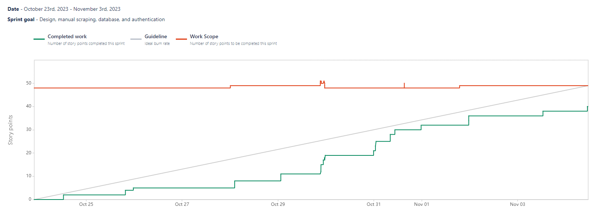
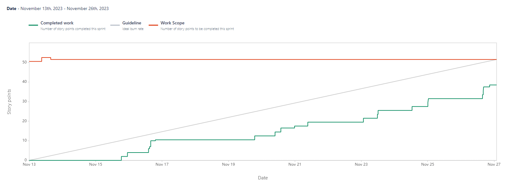

# Recipes App

> Live demo [_here_](https://recipegenerator-db0be.web.app/). <!-- If you have the project hosted somewhere, include the link here. -->

## Table of Contents

- [General Info](#our-team)
- [Technologies Used](#technologies-used)
- [Features](#features)
- [Contributions](#contributions)
- [Reports](#reports)
- [Screenshots](#screenshots)
- [Setup](#setup)
- [Usage](#usage)
- [Project Status](#project-status)
- [Room for Improvement](#room-for-improvement)
- [Acknowledgements](#acknowledgements)
- [Contact](#contact)
<!-- * [License](#license) -->

## Our Team

- Jeffrey Hsu
- April Valdez
- Brent Hoover
- Viet Vu
- Mandil Pradhan

## Our Vision

- We are building a recipe generating application so food enthusiasts can conveniently browse recipes based on the ingredients they currently have in stock.

## Technologies Used

- React.js
- HTML
- Firebase
- GitKraken

## Features

### Sprint 1

#### Contributions

**Brent**: "provided users with a simple form for saving, storing, and displaying their ingredient entries" 

  - `Jira Task: Brent - textboxes to enter ingredients (incld. amount and other details)` 
    - [Scrum-25](https://cs3398f23klingons.atlassian.net/jira/software/projects/SCRUM/boards/1?selectedIssue=SCRUM-25), 
    [Bitbucket](https://bitbucket.org/cs3398f23klingons/recipes-repo/commits/branch/feature%2FSCRUM-25-bah4-create-textbox) 
  - `Jira Task: Brent - save ingredient entries somewhere` 
    - [Scrum-26](https://cs3398f23klingons.atlassian.net/jira/software/projects/SCRUM/boards/1?selectedIssue=SCRUM-26), 
    [Bitbucket](https://bitbucket.org/cs3398f23klingons/recipes-repo/commits/branch/feature%2FSCRUM-26-brent---save-ingredient-entries) 
  - `Jira Task: Brent - show added ingredients` 
    - [Scrum-28](https://cs3398f23klingons.atlassian.net/jira/software/projects/SCRUM/boards/1?selectedIssue=SCRUM-28), 
    [Bitbucket](https://bitbucket.org/cs3398f23klingons/recipes-repo/commits/branch/SCRUM-28-brent---show-added-ingredients) 
  - `Jira Task: Brent - add unit tests to make sure textboxes work correctly` 
    - [Scrum-33](https://cs3398f23klingons.atlassian.net/jira/software/projects/SCRUM/boards/1?selectedIssue=SCRUM-33), 
    [Bitbucket](https://bitbucket.org/cs3398f23klingons/recipes-repo/commits/branch/feature%2FSCRUM-33-brent---add-unit-tests-for-textbox) 
  - `Jira Task: Brent - research existing databases` 
    - [Scrum-31](https://cs3398f23klingons.atlassian.net/jira/software/projects/SCRUM/boards/1?selectedIssue=SCRUM-31),
    [Bitbucket](https://bitbucket.org/cs3398f23klingons/recipes-repo/commits/branch/feature%2FSCRUM-31-brent---research-databases) 
  - `Jira Task: Brent - Brent - research scraping api` 
    - [Scrum-30](https://cs3398f23klingons.atlassian.net/jira/software/projects/SCRUM/boards/1?selectedIssue=SCRUM-30), 
    [Bitbucket](https://bitbucket.org/cs3398f23klingons/recipes-repo/commits/branch/feature%2FSCRUM-30-brent---research-scraping-api)
 

**Viet**:"provided text boxes for user inputs and add tests to make sure input components function correctly, researched some potential APIs that could be used in the app"

  - `Jira Task: Viet - textboxes to enter ingredients (incld. amount and other details)`
    - [Scrum-38](https://cs3398f23klingons.atlassian.net/jira/software/projects/SCRUM/boards/1?selectedIssue=SCRUM-38),
    [Bitbucket](https://bitbucket.org/cs3398f23klingons/recipes-repo/commits/branch/feature%2FSCRUM-38-llv43-create-textbox)
  - `Jira Task: Viet - save ingredient entries somewhere`
    - [Scrum-39](https://cs3398f23klingons.atlassian.net/jira/software/projects/SCRUM/boards/1?selectedIssue=SCRUM-39),
    [Bitbucket](https://bitbucket.org/cs3398f23klingons/recipes-repo/commits/branch/feature%2FSCRUM-39-viet---save-ingredient-entries-)
  - `Jira Task: Viet - show added ingredients`
    - [Scrum-41](https://cs3398f23klingons.atlassian.net/jira/software/projects/SCRUM/boards/1?selectedIssue=SCRUM-41),
    [Bitbucket](https://bitbucket.org/cs3398f23klingons/recipes-repo/commits/branch/feature%2FSCRUM-41-viet--show-added-ingredients)
  - `Jira Task: Viet - add unit tests to make sure textboxes work correctly`
    - [Scrum-41](https://cs3398f23klingons.atlassian.net/jira/software/projects/SCRUM/boards/1?selectedIssue=SCRUM-40),
    [Bitbucket](https://bitbucket.org/cs3398f23klingons/recipes-repo/commits/branch/feature%2FSCRUM-40-viet---add-unit-tests-to-make-s)
  - `Jira Task: Viet - research scraping api`
    - [Scrum-42](https://cs3398f23klingons.atlassian.net/jira/software/projects/SCRUM/boards/1?selectedIssue=SCRUM-42),
    [Bitbucket](https://bitbucket.org/cs3398f23klingons/recipes-repo/commits/branch/feature%2FSCRUM-42-viet---research-scraping-api)
  - `Jira Task: Viet - research manual scraping techniques`
    - [Scrum-43](https://cs3398f23klingons.atlassian.net/jira/software/projects/SCRUM/boards/1?selectedIssue=SCRUM-43),
    [Bitbucket](https://bitbucket.org/cs3398f23klingons/recipes-repo/commits/branch/feature%2FSCRUM-43-viet---research-manual-scraping)
  - `Jira Task: Viet - research existing databases`
    - [Scrum-44](https://cs3398f23klingons.atlassian.net/jira/software/projects/SCRUM/boards/1?selectedIssue=SCRUM-44),
    [Bitbucket](https://bitbucket.org/cs3398f23klingons/recipes-repo/commits/branch/feature%2FSCRUM-44-viet---research-existing-databa)
 

**Jeff**: "provided users with a way to input, store, and see the ingredients they have in stock"

  - `Jira Task: Jeff - textboxes to enter ingredients (incld. amount and other details)`
    - [SRUM-59](https://cs3398f23klingons.atlassian.net/browse/SCRUM-59),
    [Bitbucket](https://bitbucket.org/cs3398f23klingons/%7B973a6ba3-a025-481e-a3dd-3e0bd88f694d%7D/branch/feature/SCRUM-59-jeff---textboxes-to-enter-ingre)
  - `Jira Task: Jeff - save ingredient entries somewhere`
    - [SCRUM-60](https://cs3398f23klingons.atlassian.net/browse/SCRUM-60),
    [Bitbucket](https://bitbucket.org/cs3398f23klingons/%7B973a6ba3-a025-481e-a3dd-3e0bd88f694d%7D/branch/feature/SCRUM-60-jeff--save-ingredient-entries-s)
  - `Jira Task: Jeff - research manual scraping techniques`
    - [SCRUM-64](https://cs3398f23klingons.atlassian.net/browse/SCRUM-64),
    [Bitbucket](https://bitbucket.org/cs3398f23klingons/%7B973a6ba3-a025-481e-a3dd-3e0bd88f694d%7D/branch/SCRUM-64-jeff---research-manual-scraping)
  - `Jira Task: Jeff - show added ingredients`
    - [SCRUM-62](https://cs3398f23klingons.atlassian.net/browse/SCRUM-62),
    [Bitbucket](https://bitbucket.org/cs3398f23klingons/%7B973a6ba3-a025-481e-a3dd-3e0bd88f694d%7D/branch/feature/SCRUM-62-jeff--show-added-ingredients)
  - `Jira Task: Jeff - add unit tests to make sure textboxes work correctly`
    - [SCRUM-61](https://bitbucket.org/cs3398f23klingons/%7B973a6ba3-a025-481e-a3dd-3e0bd88f694d%7D/branch/feature/SCRUM-62-jeff--show-added-ingredients),
    [Bitbucket](https://bitbucket.org/cs3398f23klingons/%7B973a6ba3-a025-481e-a3dd-3e0bd88f694d%7D/branch/feature/SCRUM-61-jeff--add-unit-tests-to-make-su)
  - `Jira Task: Jeff - research scraping api`
    - [SCRUM-63](https://cs3398f23klingons.atlassian.net/browse/SCRUM-63)
    [Bitbucket](https://bitbucket.org/cs3398f23klingons/recipes-repo/commits/6a799319270ee8743fe799bdd6fb1c185f20c1b6)
  - `Jira Task: Jeff - existing databases`
    - [SCRUM-65](https://cs3398f23klingons.atlassian.net/browse/SCRUM-65),
    [Bitbucket](https://bitbucket.org/cs3398f23klingons/recipes-repo/commits/01c42711ee386a4ca4688b141565d604841c8109)
 

**April**: "provided users with a way to input, store, and see the ingredients they have in stock"

  - `Jira Task: April - textboxes to enter ingredients (incld. amount and other details)`
    - [SRUM-45](https://cs3398f23klingons.atlassian.net/browse/SCRUM-45),
    [Bitbucket](https://bitbucket.org/cs3398f23klingons/recipes-repo/branch/bugfix/SCRUM-45-april---textboxes-to-enter-ingr)
  - `Jira Task: April - show added ingredients`
    - [SCRUM-47](https://cs3398f23klingons.atlassian.net/browse/SCRUM-47),
    [Bitbucket](https://bitbucket.org/cs3398f23klingons/recipes-repo/branch/feature/SCRUM-47-april---show-added-ingredients)
  - `Jira Task: April - save ingredient entries somewhere`
    - [SCRUM-49](https://cs3398f23klingons.atlassian.net/browse/SCRUM-49),
    [Bitbucket](https://bitbucket.org/cs3398f23klingons/recipes-repo/branch/feature/SCRUM-49-april---save-ingredient-entries)
  - `Jira Task: April - add unit tests to make sure textboxes work correctly`
    - [SCRUM-46](https://cs3398f23klingons.atlassian.net/browse/SCRUM-46),
    [Bitbucket](https://bitbucket.org/cs3398f23klingons/recipes-repo/branch/feature/SCRUM-46-april---add-unit-tests-to-make-)
 

**Mandil**: "incorporated a framework for structuring the web page layout and integrated various widgets and components to enable user input processing and display functionality"

  - `Jira Task: Mandil - Widgets to input and display user ingredients`
    - [SRUM- 52](https://cs3398f23klingons.atlassian.net/browse/SCRUM-52),
    [Bitbucket](https://bitbucket.org/cs3398f23klingons/%7B973a6ba3-a025-481e-a3dd-3e0bd88f694d%7D/branch/feature/SCRUM-52-mandil---Input-ingredient-box)
  - `Jira Task: Mandil -  Incorporated page routing`
    - [SCRUM-55](https://cs3398f23klingons.atlassian.net/browse/SCRUM-55),
    [Bitbucket](https://bitbucket.org/cs3398f23klingons/%7B973a6ba3-a025-481e-a3dd-3e0bd88f694d%7D/branch/feature/SCRUM-55-mandil---all-features-combined-)
  - `Jira Task: Mandil -Incorporated layout for homepage`
    - [SCRUM-53](https://cs3398f23klingons.atlassian.net/browse/SCRUM-53),
    [Bitbucket](https://bitbucket.org/cs3398f23klingons/%7B973a6ba3-a025-481e-a3dd-3e0bd88f694d%7D/branch/feature/SCRUM-53-Explore-layout-for-display)
  - `Jira Task: Mandil - unit test functionality of Input Ingredient widget`
    - [SCRUM-54](https://cs3398f23klingons.atlassian.net/browse/SCRUM-54),
    [Bitbucket](https://bitbucket.org/cs3398f23klingons/%7B973a6ba3-a025-481e-a3dd-3e0bd88f694d%7D/branch/feature/SCRUM-54-mandil---add-unit-tests-to-make)
  - `Jira Task: Mandil - Improved layout for display to include Featured section`
    - [SCRUM-67](https://cs3398f23klingons.atlassian.net/browse/SCRUM-67),
    [Bitbucket](https://bitbucket.org/cs3398f23klingons/%7B973a6ba3-a025-481e-a3dd-3e0bd88f694d%7D/branch/feature/SCRUM-67-explore-layout-for-display)
  - `Jira Task: Mandil - Research manual scraping options`
    - [SCRUM-56](https://cs3398f23klingons.atlassian.net/browse/SCRUM-56),
    [Bitbucket](https://bitbucket.org/cs3398f23klingons/%7B973a6ba3-a025-481e-a3dd-3e0bd88f694d%7D/branch/SCRUM-56-mandil---research-scraping-api)
  - `Jira Task: Mandil - research database options`
    - [SCRUM-58](https://cs3398f23klingons.atlassian.net/browse/SCRUM-58),
    [Bitbucket](https://bitbucket.org/cs3398f23klingons/%7B973a6ba3-a025-481e-a3dd-3e0bd88f694d%7D/branch/SCRUM-58-mandil---research-existing-data)
  - `Jira Task: Mandil - research database options`
    - [SCRUM-57](https://cs3398f23klingons.atlassian.net/browse/SCRUM-57),
    [Bitbucket](https://bitbucket.org/cs3398f23klingons/%7B973a6ba3-a025-481e-a3dd-3e0bd88f694d%7D/branch/SCRUM-57-mandil---research-api-based-imp)
 

#### Reports

#### Next Steps

**Brent**:

  - Develop consistent layout for application
  - Add links to YouTube videos that offer tip and tutorials on how to cook difficult recipes
  - Add images to recipes so our users can visualize what they're making
 

**Viet**:

  - Develop consistent layout for application
  - provide users with functionalities to create an account and log into the account
  - create the schema to store user data to the database
 

**Jeff**:

  - Develop consistent layout for application
  - Construct database for storing user ingredients and the recipes they generate
 

**April**:

  - Develop consistent layout for application
  - Fetch recipes from websites using REST APIs
 

**Mandil**:

  - Develop consistent layout for application
  - Explore user authentication using firebase
  - Reorganize application layout and add components to the NavBar
  - Create feature that lets users construct their own recipes from scratch
 

### Sprint 2

#### Contributions

**Brent**: "provided users with a tool to help them create their own recipes and updated the navigation bar so they can navigate through the website more easily" 

  - `Jira Task: Create sidebar component and update sidebar` 
    - [Scrum-71](https://cs3398f23klingons.atlassian.net/jira/software/projects/SCRUM/boards/1?selectedIssue=SCRUM-71), 
    [Bitbucket](https://bitbucket.org/cs3398f23klingons/recipes-repo/commits/branch/feature%2FSCRUM-71-create-sidebar-component) 
  - `Jira Task: Customize and design Create Recipes page` 
    - [Scrum-74](https://cs3398f23klingons.atlassian.net/jira/software/projects/SCRUM/boards/1?selectedIssue=SCRUM-74), 
    [Bitbucket](https://bitbucket.org/cs3398f23klingons/recipes-repo/commits/branch/feature%2FSCRUM-74-customize-and-design-create-recipes) 
  - `Jira Task: Add directions and customize display to Create Recipe` 
    - [Scrum-72](https://cs3398f23klingons.atlassian.net/jira/software/projects/SCRUM/boards/1?selectedIssue=SCRUM-72), 
    [Bitbucket](https://bitbucket.org/cs3398f23klingons/recipes-repo/commits/branch/feature%2FSCRUM-72-add-directions-and-customize-display) 
  - `Jira Task: Add function that removes entries in Create Recipe` 
    - [Scrum-75](https://cs3398f23klingons.atlassian.net/jira/software/projects/SCRUM/boards/1?selectedIssue=SCRUM-75), 
    [Bitbucket](https://bitbucket.org/cs3398f23klingons/recipes-repo/commits/branch/SCRUM-75-add-function-that-removes-entries) 
  - `Jira Task: Update navbar and sidebar with new components` 
    - [Scrum-70](https://cs3398f23klingons.atlassian.net/jira/software/projects/SCRUM/boards/1?selectedIssue=SCRUM-70),
    [Bitbucket](https://bitbucket.org/cs3398f23klingons/recipes-repo/commits/branch/feature%2FSCRUM-70-include-new-routes-for-sidebar) 
 

**Viet**: "implemented functionalities to fetch and save recipes from REST API calls to Firestore database, set up basic Firebase security rules"

  - `Jira Task: Implement REST API call to fetch recipes based on user's ingredients`
    - [Scrum-95](https://cs3398f23klingons.atlassian.net/jira/software/projects/SCRUM/boards/1?selectedIssue=SCRUM-95),
    [Bitbucket](https://bitbucket.org/cs3398f23klingons/recipes-repo/commits/branch/feature%2FSCRUM-95-implement-rest-api-call-to-fetch)
  - `Jira Task: Add functionalities to save recipes returned from API calls to the database`
    - [Scrum-94](https://cs3398f23klingons.atlassian.net/jira/software/projects/SCRUM/boards/1?selectedIssue=SCRUM-94),
    [Bitbucket](https://bitbucket.org/cs3398f23klingons/recipes-repo/commits/branch/feature%2FSCRUM-94-add-functionalities-to-save-rec)
  - `Jira Task: Add link to recipe card to redirect user to recipe page`
    - [Scrum-99](https://cs3398f23klingons.atlassian.net/jira/software/projects/SCRUM/boards/1?selectedIssue=SCRUM-99),
    [Bitbucket](https://bitbucket.org/cs3398f23klingons/recipes-repo/commits/branch/feature%2FSCRUM-99-add-link-to-recipe-card-to-redi)
  - `Jira Task: Research Firestore authentication and security rules`
    - [Scrum-90](https://cs3398f23klingons.atlassian.net/jira/software/projects/SCRUM/boards/1?selectedIssue=SCRUM-90),
    [Bitbucket](https://bitbucket.org/cs3398f23klingons/recipes-repo/commits/branch/feature%2FSCRUM-90-research-firestore-authenticati)
  - `Jira Task: Set up Firestore security rules to manage access to the database`
    - [Scrum-91](https://cs3398f23klingons.atlassian.net/jira/software/projects/SCRUM/boards/1?selectedIssue=SCRUM-91),
    [Bitbucket](https://bitbucket.org/cs3398f23klingons/recipes-repo/commits/branch/SCRUM-91-set-up-firestore-security-rules)
 

**April**: "Provied user with a means of logging/signin up for our website. Extracted user info from Firebase for better user eperience."

  - `Jira Task: April - Design and create login page`
    - [SRUM-79](https://cs3398f23klingons.atlassian.net/browse/SCRUM-79),
    [Bitbucket](https://bitbucket.org/cs3398f23klingons/recipes-repo/branch/feature/SCRUM-79-design-and-create-login-page)
  - `Jira Task: April - Implement basic signup functionality`
    - [SCRUM-96](https://cs3398f23klingons.atlassian.net/browse/SCRUM-96),
    [Bitbucket](https://bitbucket.org/cs3398f23klingons/recipes-repo/branch/feature/SCRUM-96-implement-basic-signup-function)
  - `Jira Task: April - Implement basic login functionality`
    - [SCRUM-97](https://cs3398f23klingons.atlassian.net/browse/SCRUM-97),
    [Bitbucket](https://bitbucket.org/cs3398f23klingons/recipes-repo/branch/feature/SCRUM-97-implement-basic-login-functiona)
  - `Jira Task: April - Design and create profile page`
    - [SCRUM-80](https://cs3398f23klingons.atlassian.net/browse/SCRUM-80),
    [Bitbucket](https://bitbucket.org/cs3398f23klingons/recipes-repo/branch/feature/SCRUM-80-design-and-create-profile-page)
 

**Mandil**: "Implemened react components to render data utilizing databse and restructure components to render reponse based content"

   - `Jira Task: Set up webpage to use firestore and storage for respective images`
    - [Scrum-69](https://cs3398f23klingons.atlassian.net/browse/SCRUM-69), 
    [Bitbucket](https://bitbucket.org/cs3398f23klingons/recipes-repo/branch/SCRUM-69-Mandil-Setup-firesbase) 
  - `Jira Task: Integrate react to utilize the entries instead of placeholder card` 
    - [Scrum-83](https://cs3398f23klingons.atlassian.net/browse/SCRUM-83), 
    [Bitbucket](https://bitbucket.org/cs3398f23klingons/recipes-repo/branch/feature/SCRUM-83-integrate-react-to-utilize-fire) 
  - `Jira Task: Update database with sample entries and parser required to extract data from external API` 
    - [Scrum-85](https://cs3398f23klingons.atlassian.net/browse/SCRUM-85), 
    [Bitbucket](https://bitbucket.org/cs3398f23klingons/recipes-repo/branch/feature/SCRUM-85-update-database-with-sample-ent) 
  - `Jira Task: Design databse model schema` 
    - [Scrum-84](https://cs3398f23klingons.atlassian.net/browse/SCRUM-84), 
    [Bitbucket](https://bitbucket.org/cs3398f23klingons/recipes-repo/branch/feature/SCRUM-84-design-databse-model-schema) 

 

**Jeff**: "designed initial set of aesthetic passes and related functionalities; prototyped manually scraped database and recipe scoring"

  - `Jira Task: Create Landing Page` 
    - [Scrum-87](https://cs3398f23klingons.atlassian.net/browse/SCRUM-87),
    [Bitbucket](https://bitbucket.org/cs3398f23klingons/%7B973a6ba3-a025-481e-a3dd-3e0bd88f694d%7D/branch/feature/SCRUM-87-landing-page)
  - `Jira Task: Create themes and designs for the overall app` 
    - [Scrum-92](https://cs3398f23klingons.atlassian.net/browse/SCRUM-92),
    [Bitbucket](https://bitbucket.org/cs3398f23klingons/%7B973a6ba3-a025-481e-a3dd-3e0bd88f694d%7D/branch/feature/SCRUM-92-create-themes-and-designs-for-t)
  - `Jira Task: Add functionalities for themes for ease of finalizing designs` 
    - [Scrum-89](https://cs3398f23klingons.atlassian.net/browse/SCRUM-89),
    [Bitbucket](https://bitbucket.org/cs3398f23klingons/%7B973a6ba3-a025-481e-a3dd-3e0bd88f694d%7D/branch/feature/SCRUM-89-add-functionalities-for-themes-)
  - `Jira Task: Scrape online recipes for temporary offline database` 
    - [Scrum-86](https://cs3398f23klingons.atlassian.net/browse/SCRUM-86),
    [Bitbucket](https://bitbucket.org/cs3398f23klingons/%7B973a6ba3-a025-481e-a3dd-3e0bd88f694d%7D/branch/SCRUM-86-scrape-online-recipes-for-tempo)
  - `Jira Task: Prototype matching and scoring recipes given ingredients`
    - [Scrum-93](https://cs3398f23klingons.atlassian.net/browse/SCRUM-93),
    [Bitbucket](https://bitbucket.org/cs3398f23klingons/%7B973a6ba3-a025-481e-a3dd-3e0bd88f694d%7D/branch/SCRUM-93-prototype-matching-and-scoring-)
 

#### Reports

#### Next Steps

**Brent**:

  - Add a submit button to the Create Recipe page so users can save their recipes to our database
  - Create a tool for user's to add images to their newly created recipe
  - Add an API tool to the Create Recipe page so user's can get help with creating their own recipes
 

**Viet**:

  - Implement functionalities to search recipes by ingredients or by recipe name from database
  - Add more recipe's information to recipe page
  - Set up more restricted Firebase security rules
 

**April**:

  - Incorporate more personalization to improve user experience
  - Give user more customization options
 

**Mandil**:

  - Implement database query to search recipe using Ingredients list
  - Render search result page linking to the recipe page
  - Add functionality to the fiter options in search box
  - Implement Firebase Hosting
   

**Jeff**:

  - Explore and work on deployment options
  - Setup support pipeline
  - Create end-to-end tests for entire app
 

### Sprint 3

#### Contributions

**Brent**: "provided users with a dynamic Tips & Tutorials page that lets them watch cooking videos and helps them with their next recipe"

  - `Jira Task: Add website footer that includes information and helpful links` 
    - [Scrum-100](https://cs3398f23klingons.atlassian.net/jira/software/projects/SCRUM/boards/1?selectedIssue=SCRUM-100), 
    [Bitbucket](https://bitbucket.org/cs3398f23klingons/recipes-repo/commits/branch/SCRUM-100-add-website-footer) 
  - `Jira Task: Create and design an About Us page` 
    - [Scrum-101](https://cs3398f23klingons.atlassian.net/jira/software/projects/SCRUM/boards/1?selectedIssue=SCRUM-101), 
    [Bitbucket](https://bitbucket.org/cs3398f23klingons/recipes-repo/commits/branch/feature%2FSCRUM-101-create-about-us-page) 
  - `Jira Task: Create option for users to add photos to their created recipes` 
    - [Scrum-103](https://cs3398f23klingons.atlassian.net/jira/software/projects/SCRUM/boards/1?selectedIssue=SCRUM-103), 
    [Bitbucket](https://bitbucket.org/cs3398f23klingons/recipes-repo/commits/branch/feature%2FSCRUM-103-create-option-for-users-to-add) 
  - `Jira Task: Create and design Tips & Tutorials page` 
    - [Scrum-102](https://cs3398f23klingons.atlassian.net/jira/software/projects/SCRUM/boards/1?selectedIssue=SCRUM-102), 
    [Bitbucket](https://bitbucket.org/cs3398f23klingons/recipes-repo/commits/branch/feature%2FSCRUM-102-create-and-design-tips-tutoria) 
 

#### Reports

#### Next Steps

**Brent**:

  - Add an openAI tool to the Tips & Tutorials page so users can receive additional help with their recipes
  - Provide users with a search bar or filtering tool so they can specify the types of cooking videos they'd like to watch
  - Add a save button to each cooking video so users can store them on their account
 

## Reflections on Successes and Opportunities for Growth

### What Went Well:

- We were consistent with our branching, pull requests, and keeping our GitKraken tree organized
- We worked as a team when handling bugs, merge conflicts, and approving pull requests in a timely manner
- We communicated well by listening to each others ideas and making sure that everyone had a voice in the conversation
- We continued to offer constructive criticims and provide helpful feedback
- We shared links to resources that were helpful to our tasks

### Ways To Improve:

- We could have organized more meetups discussing some of the shared obstacles and roadblocks we were encountering
- We could have ensured better synchronization of our task executions to anticipate potential interdependencies
- We could have provided more discussions about our individual implementations before coding. This would have fostered collaborative improvement

<!-- If you have screenshots you'd like to share, include them here. -->
## Setup

What are the project requirements/dependencies? Where are they listed? A requirements.txt or a Pipfile.lock file perhaps? Where is it located?

Proceed to describe how to install / setup one's local environment / get started with the project.

## Usage

How does one go about using it?
Provide various use cases and code examples here.

`write-your-code-here`

## Project Status

Project: _in progress_

## Acknowledgements

### Helpful Tutorials:

- [Full React Tutorial](https://www.youtube.com/watch?v=j942wKiXFu8&list=PL4cUxeGkcC9gZD-Tvwfod2gaISzfRiP9d)
- [React Tutorial for Beginners](https://www.youtube.com/watch?v=SqcY0GlETPk)
- [React Testing Library](https://www.youtube.com/watch?v=7dTTFW7yACQ)
- [Bootstrap Crash Course](https://www.youtube.com/watch?v=O_9u1P5YjVc&list=PL4cUxeGkcC9joIM91nLzd_qaH_AimmdAR)
 - [Getting Started with Firebase](https://www.youtube.com/watch?v=9zdvmgGsww0&list=PL4cUxeGkcC9jERUGvbudErNCeSZHWUVlb&index=1)
- [Firebase React Course For Beginners](https://www.youtube.com/watch?v=2hR-uWjBAgw)
- [Authentication in ReactJS Using Firebase: A Step-by-Step Guide](https://www.youtube.com/watch?v=Vv_Oi7zPPTw)

## Contact

Created by: [@flynerdpl](https://www.flynerd.pl/) - feel free to contact me!

<!-- Optional -->
<!-- ## License -->
<!-- This project is open source and available under the [... License](). -->

<!-- You don't have to include all sections - just the one's relevant to your project -->
